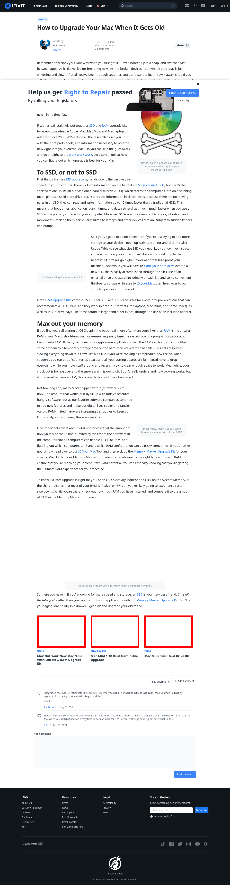

# Post 10073 - [How to Upgrade Your Mac When It Gets Old](https://www.ifixit.com/News/10073/how-to-speed-up-your-aging-mac)

- https://valkyrie.cdn.ifixit.com/media/2018/12/05173430/mac-mini-ram-upgrade-kit-600x400.jpeg
- https://valkyrie.cdn.ifixit.com/media/2009/03/05150607/mac-mini-1tb-dual-hard-drive-upgrade-600x400.jpeg
- https://valkyrie.cdn.ifixit.com/media/2011/08/05153042/mac-mini-dual-hard-drive-kit-600x400.jpeg

