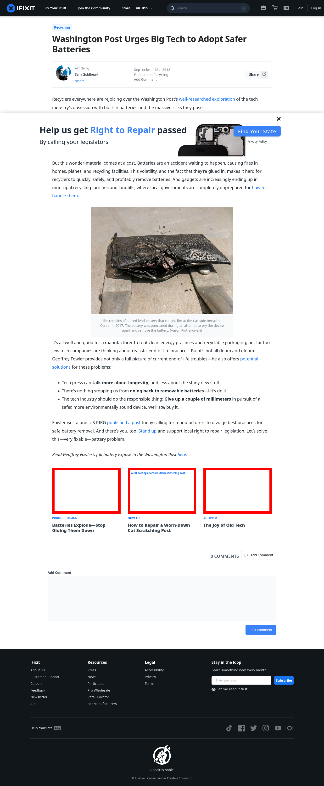

# Post 11442 - [Washington Post Urges Big Tech to Adopt Safer Batteries](https://www.ifixit.com/News/11442/washington-post-urges-big-tech-to-adopt-safer-batteries)

- https://valkyrie.cdn.ifixit.com/media/2016/10/05170146/batteries-explode-note7-600x400.jpeg
- https://valkyrie.cdn.ifixit.com/media/2019/06/18083503/cat-scratch-2-600x400.jpg
- https://valkyrie.cdn.ifixit.com/media/2013/03/05154935/the-joy-of-old-tech-600x400.jpeg
- https://valkyrie.cdn.ifixit.com/media/2013/03/05154935/the-joy-of-old-tech-600x400.jpeg
- https://valkyrie.cdn.ifixit.com/media/2013/03/05154935/the-joy-of-old-tech-300x200.jpeg
- https://valkyrie.cdn.ifixit.com/media/2013/03/05154935/the-joy-of-old-tech-768x512.jpeg
- https://valkyrie.cdn.ifixit.com/media/2013/03/05154935/the-joy-of-old-tech-324x216.jpeg
- https://valkyrie.cdn.ifixit.com/media/2013/03/05154935/the-joy-of-old-tech-450x300.jpeg

