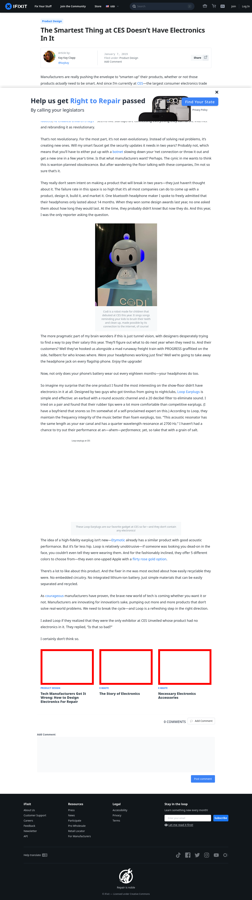

# Post 12614 - [The Smartest Thing at CES Doesn&#8217;t Have Electronics In It](https://www.ifixit.com/News/12614/ces-2019)

- https://valkyrie.cdn.ifixit.com/media/2012/12/05154646/what-tech-manufacturers-have-wrong-how-to-design-electronics-for-repair-600x400.jpeg
- https://valkyrie.cdn.ifixit.com/media/2012/12/05154646/what-tech-manufacturers-have-wrong-how-to-design-electronics-for-repair-600x400.jpeg
- https://valkyrie.cdn.ifixit.com/media/2012/12/05154646/what-tech-manufacturers-have-wrong-how-to-design-electronics-for-repair-300x200.jpeg
- https://valkyrie.cdn.ifixit.com/media/2012/12/05154646/what-tech-manufacturers-have-wrong-how-to-design-electronics-for-repair-768x512.jpeg
- https://valkyrie.cdn.ifixit.com/media/2012/12/05154646/what-tech-manufacturers-have-wrong-how-to-design-electronics-for-repair-324x216.jpeg
- https://valkyrie.cdn.ifixit.com/media/2012/12/05154646/what-tech-manufacturers-have-wrong-how-to-design-electronics-for-repair-450x300.jpeg
- https://valkyrie.cdn.ifixit.com/media/2010/11/05152611/the-story-of-electronics-600x400.jpeg
- https://valkyrie.cdn.ifixit.com/media/2010/11/05152611/the-story-of-electronics-600x400.jpeg
- https://valkyrie.cdn.ifixit.com/media/2010/11/05152611/the-story-of-electronics-300x200.jpeg
- https://valkyrie.cdn.ifixit.com/media/2010/11/05152611/the-story-of-electronics-324x216.jpeg
- https://valkyrie.cdn.ifixit.com/media/2010/11/05152611/the-story-of-electronics-450x300.jpeg
- https://valkyrie.cdn.ifixit.com/media/2012/03/05153713/necessary-accessories-600x400.jpeg

