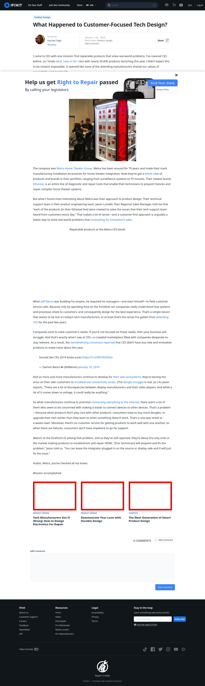

# Post 12623 - [What Happened to Customer-Focused Tech Design?](https://www.ifixit.com/News/12623/metra-home-theater-ces)

- https://valkyrie.cdn.ifixit.com/media/2012/12/05154646/what-tech-manufacturers-have-wrong-how-to-design-electronics-for-repair-600x400.jpeg
- https://valkyrie.cdn.ifixit.com/media/2012/12/05154646/what-tech-manufacturers-have-wrong-how-to-design-electronics-for-repair-600x400.jpeg
- https://valkyrie.cdn.ifixit.com/media/2012/12/05154646/what-tech-manufacturers-have-wrong-how-to-design-electronics-for-repair-300x200.jpeg
- https://valkyrie.cdn.ifixit.com/media/2012/12/05154646/what-tech-manufacturers-have-wrong-how-to-design-electronics-for-repair-768x512.jpeg
- https://valkyrie.cdn.ifixit.com/media/2012/12/05154646/what-tech-manufacturers-have-wrong-how-to-design-electronics-for-repair-324x216.jpeg
- https://valkyrie.cdn.ifixit.com/media/2012/12/05154646/what-tech-manufacturers-have-wrong-how-to-design-electronics-for-repair-450x300.jpeg
- https://valkyrie.cdn.ifixit.com/media/2012/02/05153632/demonstrate-your-love-with-durable-design-600x400.jpeg
- https://valkyrie.cdn.ifixit.com/media/2012/12/05154645/the-next-generation-of-smart-product-design-600x400.jpeg
- https://valkyrie.cdn.ifixit.com/media/2012/12/05154645/the-next-generation-of-smart-product-design-600x400.jpeg
- https://valkyrie.cdn.ifixit.com/media/2012/12/05154645/the-next-generation-of-smart-product-design-300x200.jpeg
- https://valkyrie.cdn.ifixit.com/media/2012/12/05154645/the-next-generation-of-smart-product-design-768x512.jpeg
- https://valkyrie.cdn.ifixit.com/media/2012/12/05154645/the-next-generation-of-smart-product-design-324x216.jpeg
- https://valkyrie.cdn.ifixit.com/media/2012/12/05154645/the-next-generation-of-smart-product-design-450x300.jpeg

