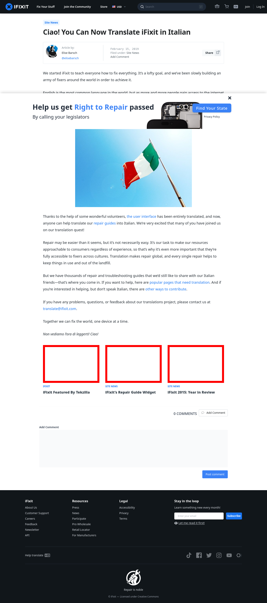

# Post 13770 - [Ciao! You Can Now Translate iFixit in Italian](https://www.ifixit.com/News/13770/ifixit-italian)

- https://valkyrie.cdn.ifixit.com/media/2009/09/05150941/ifixit-featured-by-tekzilla-600x400.jpeg
- https://valkyrie.cdn.ifixit.com/media/2009/09/05150941/ifixit-featured-by-tekzilla-600x400.jpeg
- https://valkyrie.cdn.ifixit.com/media/2009/09/05150941/ifixit-featured-by-tekzilla-300x200.jpeg
- https://valkyrie.cdn.ifixit.com/media/2009/09/05150941/ifixit-featured-by-tekzilla-768x512.jpeg
- https://valkyrie.cdn.ifixit.com/media/2009/09/05150941/ifixit-featured-by-tekzilla-324x216.jpeg
- https://valkyrie.cdn.ifixit.com/media/2009/09/05150941/ifixit-featured-by-tekzilla-450x300.jpeg
- https://valkyrie.cdn.ifixit.com/media/2010/12/05152640/ifixits-repair-guide-widget-600x400.jpeg
- https://valkyrie.cdn.ifixit.com/media/2015/12/05165051/ifixit-2015-year-in-review-600x400.jpeg

