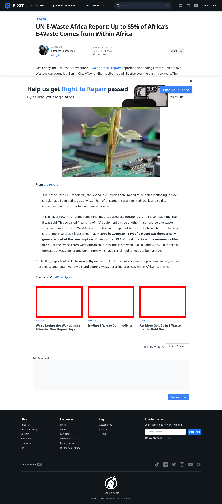

# Post 1410 - [UN E-Waste Africa Report: Up to 85% of Africa&#8217;s E-Waste Comes from Within Africa](https://www.ifixit.com/News/1410/un-report-domestic-consumption-comprises-up-to-85-of-africas-e-waste)

- https://valkyrie.cdn.ifixit.com/media/2014/01/17140032/IXBCjtm1AnTV44gC.jpg
- https://valkyrie.cdn.ifixit.com/media/2014/01/17140032/IXBCjtm1AnTV44gC.jpg
- https://valkyrie.cdn.ifixit.com/media/2014/01/17140032/IXBCjtm1AnTV44gC-300x200.jpg
- https://valkyrie.cdn.ifixit.com/media/2014/01/17140032/IXBCjtm1AnTV44gC-324x216.jpg
- https://valkyrie.cdn.ifixit.com/media/2012/02/05153625/trading-commodities-600x400.jpeg
- https://valkyrie.cdn.ifixit.com/media/2012/02/05153625/trading-commodities-600x400.jpeg
- https://valkyrie.cdn.ifixit.com/media/2012/02/05153625/trading-commodities-300x200.jpeg
- https://valkyrie.cdn.ifixit.com/media/2012/02/05153625/trading-commodities-768x512.jpeg
- https://valkyrie.cdn.ifixit.com/media/2012/02/05153625/trading-commodities-324x216.jpeg
- https://valkyrie.cdn.ifixit.com/media/2012/02/05153625/trading-commodities-450x300.jpeg
- https://valkyrie.cdn.ifixit.com/media/2012/07/05154253/far-more-gold-is-in-e-waste-than-in-gold-ore-1-600x400.jpeg

