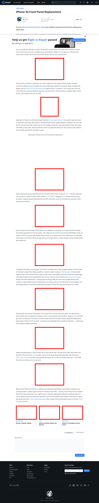

# Post 14145 - [iPhone 3G Front Panel Replacement](https://www.ifixit.com/News/14145/iphone-3g-front-panel-replacement)

- http://s1.guide-images.ifixit.com/igi/vUJfp1JwNciUl5w1.large
- http://s2.cart-products.ifixit.com/cart-products/1MQHPGA43ctNTuRw.standard.jpg
- http://s1.guide-images.ifixit.com/igi/mJxNCswHSIMJ1WpB.large
- http://s2.guide-images.ifixit.com/igi/tH4DITVuYxE2EGdb.large
- http://s1.guide-images.ifixit.com/igi/QTxiMKGEnYBBxow3.large
- http://s2.guide-images.ifixit.com/igi/1GIAQIBHvVCcKmgo.large
- http://s1.guide-images.ifixit.com/igi/COXOUGfU1YSM4oPs.large
- http://s1.guide-images.ifixit.com/igi/bKbHqjXfeK5lqVMg.large
- https://valkyrie.cdn.ifixit.com/media/2010/06/05152323/iphone-4-repair-guides-600x400.jpeg
- https://valkyrie.cdn.ifixit.com/media/2010/03/05152023/iphone-3g-glass-repair-kit-special-600x400.jpeg
- https://valkyrie.cdn.ifixit.com/media/2011/04/05152917/iphone-4-transparent-rear-panel-384x400.jpeg

