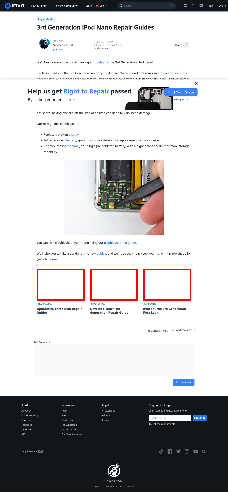

# Post 14154 - [3rd Generation iPod Nano Repair Guides](https://www.ifixit.com/News/14154/3rd-generation-ipod-nano-repair-guides)

- https://valkyrie.cdn.ifixit.com/media/2009/07/05150828/updates-to-three-ipod-guides-600x400.jpeg
- https://valkyrie.cdn.ifixit.com/media/2009/03/05150619/new-ipod-touch-1st-generation-guide-600x400.jpeg
- https://valkyrie.cdn.ifixit.com/media/2009/03/05150619/new-ipod-touch-1st-generation-guide-600x400.jpeg
- https://valkyrie.cdn.ifixit.com/media/2009/03/05150619/new-ipod-touch-1st-generation-guide-300x200.jpeg
- https://valkyrie.cdn.ifixit.com/media/2009/03/05150619/new-ipod-touch-1st-generation-guide-768x512.jpeg
- https://valkyrie.cdn.ifixit.com/media/2009/03/05150619/new-ipod-touch-1st-generation-guide-324x216.jpeg
- https://valkyrie.cdn.ifixit.com/media/2009/03/05150619/new-ipod-touch-1st-generation-guide-450x300.jpeg
- https://valkyrie.cdn.ifixit.com/media/2009/03/05150611/ipod-shuffle-3rd-generation-first-look-600x400.jpeg

