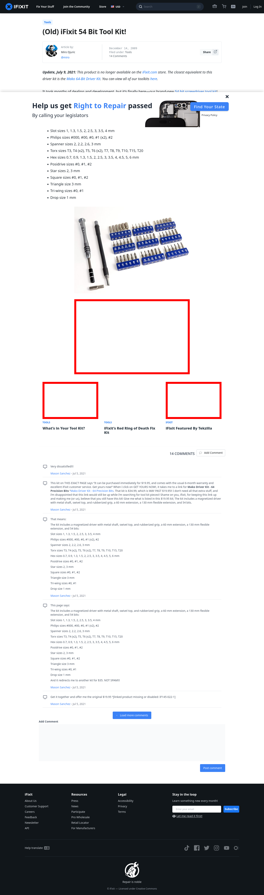

# Post 14199 - [(Old) iFixit 54 Bit Tool Kit!](https://www.ifixit.com/News/14199/new-54-bit-tool-kit-from-ifixit)

- http://s2.guide-images.ifixit.com/igi/B4r6kgRTtajy1Yls.medium
- https://valkyrie.cdn.ifixit.com/media/2012/04/05153953/whats-in-your-toolkit-600x400.jpeg
- https://valkyrie.cdn.ifixit.com/media/2009/09/05150941/ifixit-featured-by-tekzilla-600x400.jpeg
- https://valkyrie.cdn.ifixit.com/media/2009/09/05150941/ifixit-featured-by-tekzilla-600x400.jpeg
- https://valkyrie.cdn.ifixit.com/media/2009/09/05150941/ifixit-featured-by-tekzilla-300x200.jpeg
- https://valkyrie.cdn.ifixit.com/media/2009/09/05150941/ifixit-featured-by-tekzilla-768x512.jpeg
- https://valkyrie.cdn.ifixit.com/media/2009/09/05150941/ifixit-featured-by-tekzilla-324x216.jpeg
- https://valkyrie.cdn.ifixit.com/media/2009/09/05150941/ifixit-featured-by-tekzilla-450x300.jpeg

