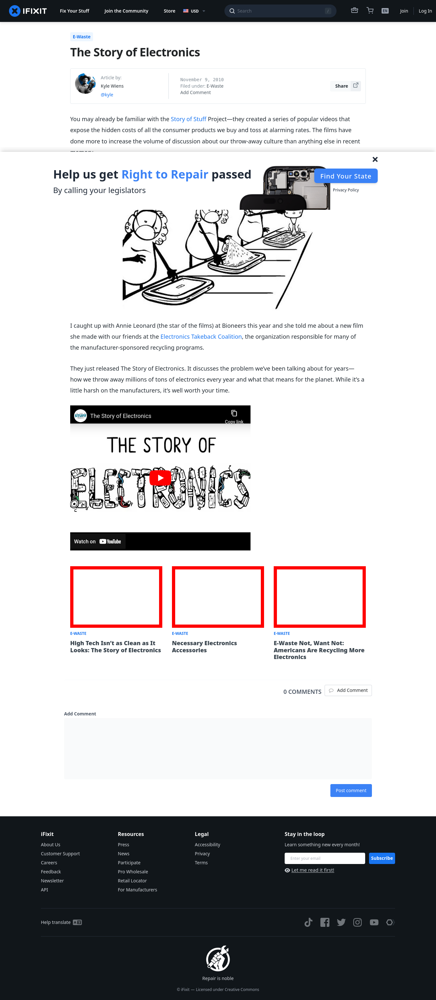

# Post 14267 - [The Story of Electronics](https://www.ifixit.com/News/14267/the-story-of-electronics)

- https://valkyrie.cdn.ifixit.com/media/2012/02/05153547/high-tech-isnt-as-clean-as-it-looks-the-story-of-electronics-600x400.jpeg
- https://valkyrie.cdn.ifixit.com/media/2012/02/05153547/high-tech-isnt-as-clean-as-it-looks-the-story-of-electronics-600x400.jpeg
- https://valkyrie.cdn.ifixit.com/media/2012/02/05153547/high-tech-isnt-as-clean-as-it-looks-the-story-of-electronics-300x200.jpeg
- https://valkyrie.cdn.ifixit.com/media/2012/02/05153547/high-tech-isnt-as-clean-as-it-looks-the-story-of-electronics-324x216.jpeg
- https://valkyrie.cdn.ifixit.com/media/2012/02/05153547/high-tech-isnt-as-clean-as-it-looks-the-story-of-electronics-450x300.jpeg
- https://valkyrie.cdn.ifixit.com/media/2012/03/05153713/necessary-accessories-600x400.jpeg
- https://valkyrie.cdn.ifixit.com/media/2015/07/05164316/e-waste-not-600x400.jpeg

