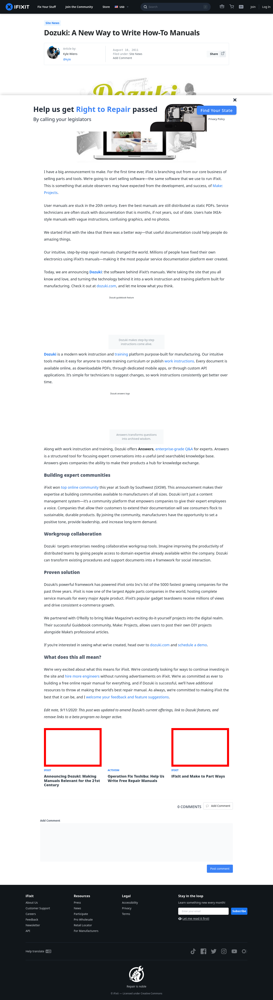

# Post 14319 - [Dozuki: A New Way to Write How-To Manuals](https://www.ifixit.com/News/14319/dozuki-a-new-way-to-write-how-to-manuals)

- https://valkyrie.cdn.ifixit.com/media/2012/04/05153958/announcing-dozuki-600x400.jpeg
- https://valkyrie.cdn.ifixit.com/media/2012/04/05153958/announcing-dozuki-600x400.jpeg
- https://valkyrie.cdn.ifixit.com/media/2012/04/05153958/announcing-dozuki-300x200.jpeg
- https://valkyrie.cdn.ifixit.com/media/2012/04/05153958/announcing-dozuki-324x216.jpeg
- https://valkyrie.cdn.ifixit.com/media/2012/04/05153958/announcing-dozuki-450x300.jpeg
- https://valkyrie.cdn.ifixit.com/media/2013/02/05154847/ifixit-and-make-to-part-ways-600x400.jpeg
- https://valkyrie.cdn.ifixit.com/media/2013/02/05154847/ifixit-and-make-to-part-ways-600x400.jpeg
- https://valkyrie.cdn.ifixit.com/media/2013/02/05154847/ifixit-and-make-to-part-ways-300x200.jpeg
- https://valkyrie.cdn.ifixit.com/media/2013/02/05154847/ifixit-and-make-to-part-ways-768x512.jpeg
- https://valkyrie.cdn.ifixit.com/media/2013/02/05154847/ifixit-and-make-to-part-ways-324x216.jpeg
- https://valkyrie.cdn.ifixit.com/media/2013/02/05154847/ifixit-and-make-to-part-ways-450x300.jpeg

