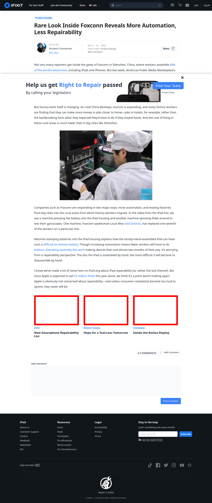

# Post 2201 - [Rare Look Inside Foxconn Reveals More Automation, Less Repairability](https://www.ifixit.com/News/2201/rare-look-inside-foxconn-reveals-more-automation-less-repairability)

- https://valkyrie.cdn.ifixit.com/media/2013/09/05155533/new-smartphone-repairability-list-600x400.jpeg
- https://valkyrie.cdn.ifixit.com/media/2013/09/05155533/new-smartphone-repairability-list-600x400.jpeg
- https://valkyrie.cdn.ifixit.com/media/2013/09/05155533/new-smartphone-repairability-list-300x200.jpeg
- https://valkyrie.cdn.ifixit.com/media/2013/09/05155533/new-smartphone-repairability-list-324x216.jpeg
- https://valkyrie.cdn.ifixit.com/media/2013/09/05155533/new-smartphone-repairability-list-450x300.jpeg
- https://valkyrie.cdn.ifixit.com/media/2012/02/05153651/hope-for-a-tool-less-tomorrow-600x400.jpeg
- https://valkyrie.cdn.ifixit.com/media/2012/02/05153651/hope-for-a-tool-less-tomorrow-600x400.jpeg
- https://valkyrie.cdn.ifixit.com/media/2012/02/05153651/hope-for-a-tool-less-tomorrow-300x200.jpeg
- https://valkyrie.cdn.ifixit.com/media/2012/02/05153651/hope-for-a-tool-less-tomorrow-324x216.jpeg
- https://valkyrie.cdn.ifixit.com/media/2012/02/05153651/hope-for-a-tool-less-tomorrow-450x300.jpeg
- https://valkyrie.cdn.ifixit.com/media/2012/06/05154219/inside-the-retina-display-600x400.jpeg

