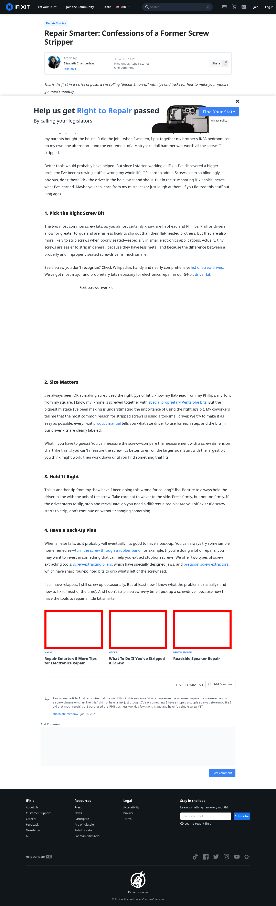

# Post 2675 - [Repair Smarter: Confessions of a Former Screw Stripper](https://www.ifixit.com/News/2675/repair-smarter-confessions-of-a-former-screw-stripper)

- https://valkyrie.cdn.ifixit.com/media/2012/09/05154415/repair-smarter-5-more-tips-for-electronics-repair-600x400.jpeg
- https://valkyrie.cdn.ifixit.com/media/2014/11/05163548/stripped-screw-600x400.jpeg
- https://valkyrie.cdn.ifixit.com/media/2014/11/05163548/stripped-screw-600x400.jpeg
- https://valkyrie.cdn.ifixit.com/media/2014/11/05163548/stripped-screw-300x200.jpeg
- https://valkyrie.cdn.ifixit.com/media/2014/11/05163548/stripped-screw-768x512.jpeg
- https://valkyrie.cdn.ifixit.com/media/2014/11/05163548/stripped-screw-324x216.jpeg
- https://valkyrie.cdn.ifixit.com/media/2014/11/05163548/stripped-screw-450x300.jpeg
- https://valkyrie.cdn.ifixit.com/media/2012/01/05153406/roadside-speaker-repair-600x400.jpeg

