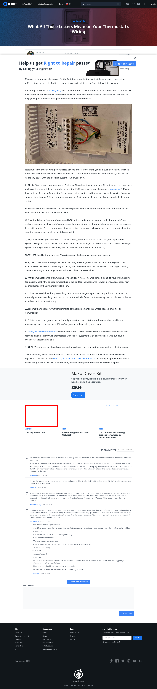

# Post 30317 - [What All Those Letters Mean on Your Thermostat&#8217;s Wiring](https://www.ifixit.com/News/30317/what-all-those-letters-mean-on-your-thermostats-wiring)

- https://valkyrie.cdn.ifixit.com/media/2013/03/05154935/the-joy-of-old-tech-600x400.jpeg
- https://valkyrie.cdn.ifixit.com/media/2013/03/05154935/the-joy-of-old-tech-600x400.jpeg
- https://valkyrie.cdn.ifixit.com/media/2013/03/05154935/the-joy-of-old-tech-300x200.jpeg
- https://valkyrie.cdn.ifixit.com/media/2013/03/05154935/the-joy-of-old-tech-768x512.jpeg
- https://valkyrie.cdn.ifixit.com/media/2013/03/05154935/the-joy-of-old-tech-324x216.jpeg
- https://valkyrie.cdn.ifixit.com/media/2013/03/05154935/the-joy-of-old-tech-450x300.jpeg

