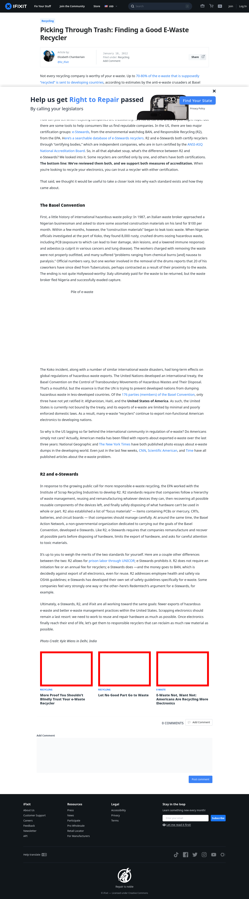

# Post 310 - [Picking Through Trash: Finding a Good E-Waste Recycler](https://www.ifixit.com/News/310/picking-through-trash-finding-a-good-e-waste-recycler)

- https://valkyrie.cdn.ifixit.com/media/2012/01/05153441/more-proof-you-shouldnt-blindly-trust-your-e-waste-recycler-600x400.jpeg
- https://valkyrie.cdn.ifixit.com/media/2012/01/05153441/more-proof-you-shouldnt-blindly-trust-your-e-waste-recycler-600x400.jpeg
- https://valkyrie.cdn.ifixit.com/media/2012/01/05153441/more-proof-you-shouldnt-blindly-trust-your-e-waste-recycler-300x200.jpeg
- https://valkyrie.cdn.ifixit.com/media/2012/01/05153441/more-proof-you-shouldnt-blindly-trust-your-e-waste-recycler-324x216.jpeg
- https://valkyrie.cdn.ifixit.com/media/2012/01/05153441/more-proof-you-shouldnt-blindly-trust-your-e-waste-recycler-450x300.jpeg
- https://valkyrie.cdn.ifixit.com/media/2012/01/05153441/more-proof-you-shouldnt-blindly-trust-your-e-waste-recycler.jpeg
- https://valkyrie.cdn.ifixit.com/media/2012/04/05153919/let-no-good-part-go-to-waste-600x400.jpeg
- https://valkyrie.cdn.ifixit.com/media/2015/07/05164316/e-waste-not-600x400.jpeg

