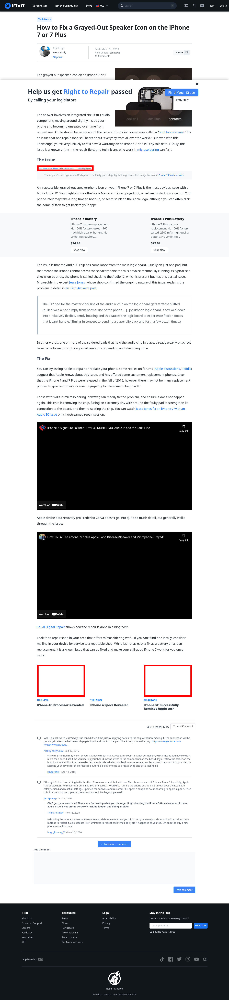

# Post 32783 - [How to Fix a Grayed-Out Speaker Icon on the iPhone 7 or 7 Plus](https://www.ifixit.com/News/32783/how-to-fix-a-grayed-out-speaker-icon-on-the-iphone-7-or-7-plus)

- https://lh4.googleusercontent.com/OTDp44gRL_T3YeZcN3gGs9VuLtprXTD29HJD9xzJuVlFPFZ7KHsTnJQIDkhtRrVHB1XVDpZHCxMP66ksei7FHLsAC9orHGh5Xt5b95wxK1rOdO-TcgZpJRYT5hSrOc4bZhSTXgNL
- https://valkyrie.cdn.ifixit.com/media/2010/05/05152247/iphone-4g-processor-revealed-600x400.jpeg
- https://valkyrie.cdn.ifixit.com/media/2010/05/05152247/iphone-4g-processor-revealed-600x400.jpeg
- https://valkyrie.cdn.ifixit.com/media/2010/05/05152247/iphone-4g-processor-revealed-300x200.jpeg
- https://valkyrie.cdn.ifixit.com/media/2010/05/05152247/iphone-4g-processor-revealed-768x512.jpeg
- https://valkyrie.cdn.ifixit.com/media/2010/05/05152247/iphone-4g-processor-revealed-324x216.jpeg
- https://valkyrie.cdn.ifixit.com/media/2010/05/05152247/iphone-4g-processor-revealed-450x300.jpeg
- https://valkyrie.cdn.ifixit.com/media/2016/03/05165406/iphone-se-successfully-remixes-apple-tech-600x400.jpeg

