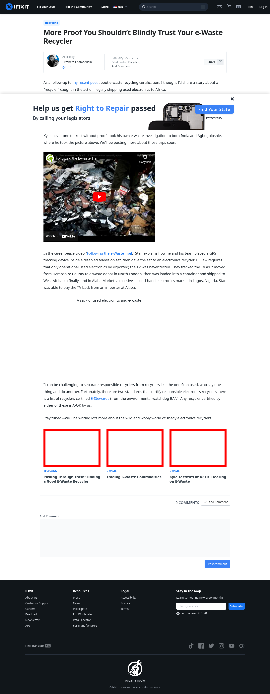

# Post 343 - [More Proof You Shouldn&#8217;t Blindly Trust Your e-Waste Recycler](https://www.ifixit.com/News/343/more-proof-you-shouldnt-blindly-trust-your-e-waste-recycler)

- https://valkyrie.cdn.ifixit.com/media/2012/01/05153328/picking-through-trash-finding-a-good-e-waste-recycler-600x400.jpeg
- https://valkyrie.cdn.ifixit.com/media/2012/02/05153625/trading-commodities-600x400.jpeg
- https://valkyrie.cdn.ifixit.com/media/2012/02/05153625/trading-commodities-600x400.jpeg
- https://valkyrie.cdn.ifixit.com/media/2012/02/05153625/trading-commodities-300x200.jpeg
- https://valkyrie.cdn.ifixit.com/media/2012/02/05153625/trading-commodities-768x512.jpeg
- https://valkyrie.cdn.ifixit.com/media/2012/02/05153625/trading-commodities-324x216.jpeg
- https://valkyrie.cdn.ifixit.com/media/2012/02/05153625/trading-commodities-450x300.jpeg
- https://valkyrie.cdn.ifixit.com/media/2012/05/05154128/kyle-testifies-at-usitc-hearing-on-e-waste-600x400.jpeg

