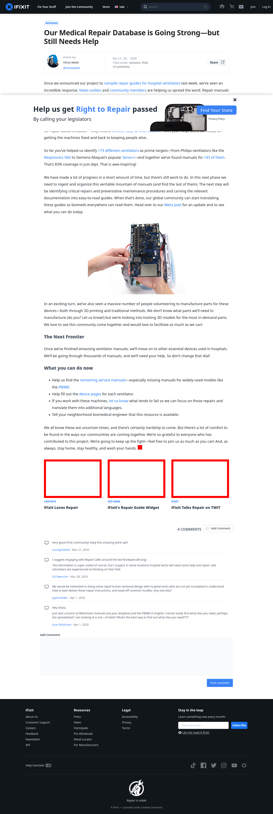

# Post 36582 - [Our Medical Repair Database is Going Strong—but Still Needs Help](https://www.ifixit.com/News/36582/our-medical-repair-database-is-going-strong-but-still-needs-help)

- https://lh4.googleusercontent.com/P5gH2L6dDSjXjoCWpmnmASoOxVC1hijg-fSYUgWS8_k8JK3Dbs1TtWG1be26fa98iwQ7-Vuz9W-KnWXd7RdqQHBl1FcrkLFLy19lfLSYvyyXDFC6jPUVwAulyU_QVvUL59FW-bY
- https://valkyrie.cdn.ifixit.com/media/2017/02/05170731/ifixit-loves-repair-600x400.jpeg
- https://valkyrie.cdn.ifixit.com/media/2010/12/05152640/ifixits-repair-guide-widget-600x400.jpeg
- https://valkyrie.cdn.ifixit.com/media/2013/11/05155738/ifixit-talks-repair-on-twit-600x400.jpeg
- https://valkyrie.cdn.ifixit.com/media/2013/11/05155738/ifixit-talks-repair-on-twit-600x400.jpeg
- https://valkyrie.cdn.ifixit.com/media/2013/11/05155738/ifixit-talks-repair-on-twit-300x200.jpeg
- https://valkyrie.cdn.ifixit.com/media/2013/11/05155738/ifixit-talks-repair-on-twit-768x512.jpeg
- https://valkyrie.cdn.ifixit.com/media/2013/11/05155738/ifixit-talks-repair-on-twit-324x216.jpeg
- https://valkyrie.cdn.ifixit.com/media/2013/11/05155738/ifixit-talks-repair-on-twit-450x300.jpeg

