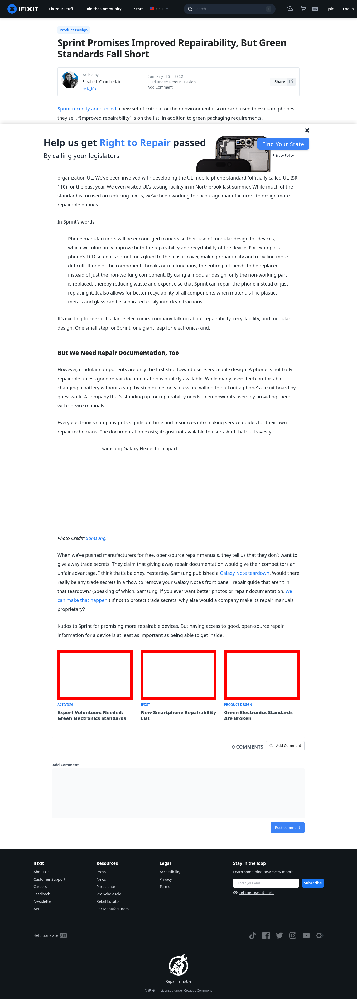

# Post 374 - [Sprint Promises Improved Repairability, But Green Standards Fall Short](https://www.ifixit.com/News/374/sprint-promises-improved-repairability-but-green-standards-still-fall-short)

- https://valkyrie.cdn.ifixit.com/media/2019/05/05174643/expert-volunteers-needed-green-electronics-standards-600x400.png
- https://valkyrie.cdn.ifixit.com/media/2019/05/05174643/expert-volunteers-needed-green-electronics-standards-600x400.png
- https://valkyrie.cdn.ifixit.com/media/2019/05/05174643/expert-volunteers-needed-green-electronics-standards-300x200.png
- https://valkyrie.cdn.ifixit.com/media/2019/05/05174643/expert-volunteers-needed-green-electronics-standards-324x216.png
- https://valkyrie.cdn.ifixit.com/media/2019/05/05174643/expert-volunteers-needed-green-electronics-standards-450x300.png
- https://valkyrie.cdn.ifixit.com/media/2013/09/05155533/new-smartphone-repairability-list-600x400.jpeg
- https://valkyrie.cdn.ifixit.com/media/2013/09/05155533/new-smartphone-repairability-list-600x400.jpeg
- https://valkyrie.cdn.ifixit.com/media/2013/09/05155533/new-smartphone-repairability-list-300x200.jpeg
- https://valkyrie.cdn.ifixit.com/media/2013/09/05155533/new-smartphone-repairability-list-324x216.jpeg
- https://valkyrie.cdn.ifixit.com/media/2013/09/05155533/new-smartphone-repairability-list-450x300.jpeg
- https://valkyrie.cdn.ifixit.com/media/2017/08/05171523/electronics-standards-600x400.jpeg

