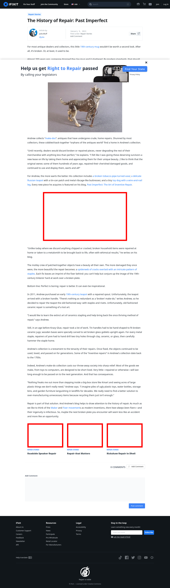

# Post 4028 - [The History of Repair: Past Imperfect](https://www.ifixit.com/News/4028/the-history-of-repair-past-imperfect)

- http://ifixit.org/files/2013/01/makedoCopy-670x387.jpg
- https://valkyrie.cdn.ifixit.com/media/2012/01/05153406/roadside-speaker-repair-600x400.jpeg
- https://valkyrie.cdn.ifixit.com/media/2012/02/05153538/repair-that-matters-600x400.jpeg
- https://valkyrie.cdn.ifixit.com/media/2012/01/05153402/fixing-rickshaws-in-delhi-600x400.jpeg
- https://valkyrie.cdn.ifixit.com/media/2012/01/05153402/fixing-rickshaws-in-delhi-600x400.jpeg
- https://valkyrie.cdn.ifixit.com/media/2012/01/05153402/fixing-rickshaws-in-delhi-300x200.jpeg
- https://valkyrie.cdn.ifixit.com/media/2012/01/05153402/fixing-rickshaws-in-delhi-768x512.jpeg
- https://valkyrie.cdn.ifixit.com/media/2012/01/05153402/fixing-rickshaws-in-delhi-324x216.jpeg
- https://valkyrie.cdn.ifixit.com/media/2012/01/05153402/fixing-rickshaws-in-delhi-450x300.jpeg

