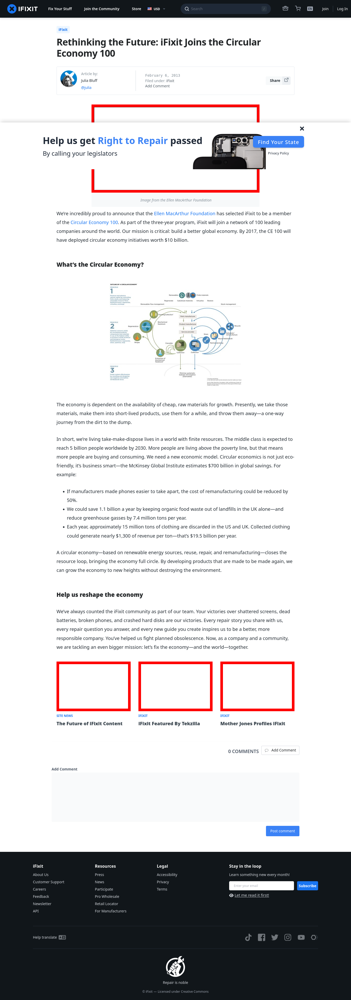

# Post 4199 - [Rethinking the Future: iFixit Joins the Circular Economy 100](https://www.ifixit.com/News/4199/rethinking-the-future-ifixit-joins-the-circular-economy-100)

- http://www.ellenmacarthurfoundation.org/uploads/new_article_0c18c5b1b44402550217405090a9065573ad6f4a.jpg.jpg
- https://valkyrie.cdn.ifixit.com/media/2010/04/05152213/the-future-of-ifixit-content-600x400.jpeg
- https://valkyrie.cdn.ifixit.com/media/2009/09/05150941/ifixit-featured-by-tekzilla-600x400.jpeg
- https://valkyrie.cdn.ifixit.com/media/2009/09/05150941/ifixit-featured-by-tekzilla-600x400.jpeg
- https://valkyrie.cdn.ifixit.com/media/2009/09/05150941/ifixit-featured-by-tekzilla-300x200.jpeg
- https://valkyrie.cdn.ifixit.com/media/2009/09/05150941/ifixit-featured-by-tekzilla-768x512.jpeg
- https://valkyrie.cdn.ifixit.com/media/2009/09/05150941/ifixit-featured-by-tekzilla-324x216.jpeg
- https://valkyrie.cdn.ifixit.com/media/2009/09/05150941/ifixit-featured-by-tekzilla-450x300.jpeg
- https://valkyrie.cdn.ifixit.com/media/2012/10/05154511/mother-jones-profiles-ifixit-600x400.jpeg

