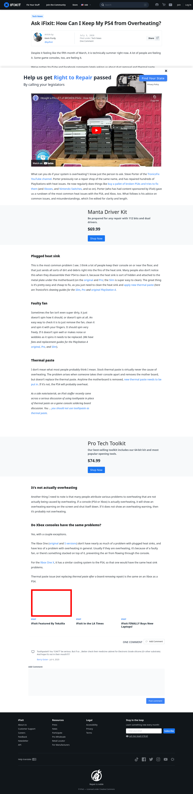

# Post 42583 - [Ask iFixit: How Can I Keep My PS4 from Overheating?](https://www.ifixit.com/News/42583/ask-ifixit-how-can-i-keep-my-ps4-from-overheating)

- https://valkyrie.cdn.ifixit.com/media/2009/09/05150941/ifixit-featured-by-tekzilla-600x400.jpeg
- https://valkyrie.cdn.ifixit.com/media/2009/09/05150941/ifixit-featured-by-tekzilla-600x400.jpeg
- https://valkyrie.cdn.ifixit.com/media/2009/09/05150941/ifixit-featured-by-tekzilla-300x200.jpeg
- https://valkyrie.cdn.ifixit.com/media/2009/09/05150941/ifixit-featured-by-tekzilla-768x512.jpeg
- https://valkyrie.cdn.ifixit.com/media/2009/09/05150941/ifixit-featured-by-tekzilla-324x216.jpeg
- https://valkyrie.cdn.ifixit.com/media/2009/09/05150941/ifixit-featured-by-tekzilla-450x300.jpeg

