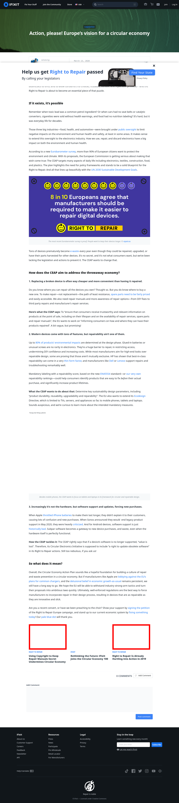

# Post 43260 - [La vision européenne de l’économie circulaire](https://www.ifixit.com/News/43260/la-vision-europeenne-de-leconomie-circulaire)

- https://valkyrie.cdn.ifixit.com/media/2013/12/05162613/using-copyright-to-keep-repair-manuals-secret-undermines-circular-economy-600x400.jpeg
- https://valkyrie.cdn.ifixit.com/media/2013/12/05162613/using-copyright-to-keep-repair-manuals-secret-undermines-circular-economy-600x400.jpeg
- https://valkyrie.cdn.ifixit.com/media/2013/12/05162613/using-copyright-to-keep-repair-manuals-secret-undermines-circular-economy-300x200.jpeg
- https://valkyrie.cdn.ifixit.com/media/2013/12/05162613/using-copyright-to-keep-repair-manuals-secret-undermines-circular-economy-768x512.jpeg
- https://valkyrie.cdn.ifixit.com/media/2013/12/05162613/using-copyright-to-keep-repair-manuals-secret-undermines-circular-economy-324x216.jpeg
- https://valkyrie.cdn.ifixit.com/media/2013/12/05162613/using-copyright-to-keep-repair-manuals-secret-undermines-circular-economy-450x300.jpeg
- https://valkyrie.cdn.ifixit.com/media/2019/01/05173620/right-to-repair-2019-600x400.jpeg

