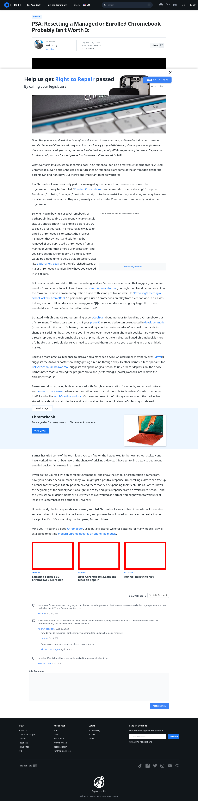

# Post 43450 - [PSA: Resetting a Managed or Enrolled Chromebook Probably Isn&#8217;t Worth It](https://www.ifixit.com/News/43450/how-to-reset-a-managed-chromebook-and-avoid-enterprise-enrollment-you-cant)

- https://valkyrie.cdn.ifixit.com/media/2011/06/05152941/samsung-series-5-3g-chromebook-teardown-1-600x400.jpeg
- https://valkyrie.cdn.ifixit.com/media/2016/03/05165324/asus-chromebook-repair-c202-600x400.jpeg
- https://valkyrie.cdn.ifixit.com/media/2014/06/05163147/reset-the-net-600x400.jpeg
- https://valkyrie.cdn.ifixit.com/media/2014/06/05163147/reset-the-net-600x400.jpeg
- https://valkyrie.cdn.ifixit.com/media/2014/06/05163147/reset-the-net-300x200.jpeg
- https://valkyrie.cdn.ifixit.com/media/2014/06/05163147/reset-the-net-768x512.jpeg
- https://valkyrie.cdn.ifixit.com/media/2014/06/05163147/reset-the-net-324x216.jpeg
- https://valkyrie.cdn.ifixit.com/media/2014/06/05163147/reset-the-net-450x300.jpeg

