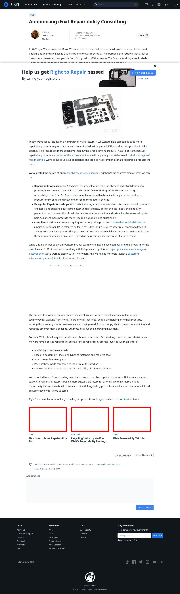

# Post 44152 - [iFixit conseille en matière de réparabilité](https://www.ifixit.com/News/44152/ifixit-conseille-en-matiere-de-reparabilite)

- https://valkyrie.cdn.ifixit.com/media/2013/09/05155533/new-smartphone-repairability-list-600x400.jpeg
- https://valkyrie.cdn.ifixit.com/media/2013/09/05155533/new-smartphone-repairability-list-600x400.jpeg
- https://valkyrie.cdn.ifixit.com/media/2013/09/05155533/new-smartphone-repairability-list-300x200.jpeg
- https://valkyrie.cdn.ifixit.com/media/2013/09/05155533/new-smartphone-repairability-list-324x216.jpeg
- https://valkyrie.cdn.ifixit.com/media/2013/09/05155533/new-smartphone-repairability-list-450x300.jpeg
- https://valkyrie.cdn.ifixit.com/media/2014/04/05163042/recycling-industry-600x400.jpeg
- https://valkyrie.cdn.ifixit.com/media/2009/09/05150941/ifixit-featured-by-tekzilla-600x400.jpeg
- https://valkyrie.cdn.ifixit.com/media/2009/09/05150941/ifixit-featured-by-tekzilla-600x400.jpeg
- https://valkyrie.cdn.ifixit.com/media/2009/09/05150941/ifixit-featured-by-tekzilla-300x200.jpeg
- https://valkyrie.cdn.ifixit.com/media/2009/09/05150941/ifixit-featured-by-tekzilla-768x512.jpeg
- https://valkyrie.cdn.ifixit.com/media/2009/09/05150941/ifixit-featured-by-tekzilla-324x216.jpeg
- https://valkyrie.cdn.ifixit.com/media/2009/09/05150941/ifixit-featured-by-tekzilla-450x300.jpeg

