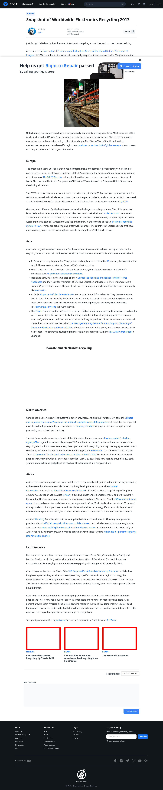

# Post 4662 - [Snapshot of Worldwide Electronics Recycling 2013](https://www.ifixit.com/News/4662/snapshot-of-worldwide-electronics-recycling-2013)

- https://valkyrie.cdn.ifixit.com/media/2012/04/05153955/consumer-electronics-recycling-up-53-in-2011-600x400.jpeg
- https://valkyrie.cdn.ifixit.com/media/2015/07/05164316/e-waste-not-600x400.jpeg
- https://valkyrie.cdn.ifixit.com/media/2010/11/05152611/the-story-of-electronics-600x400.jpeg
- https://valkyrie.cdn.ifixit.com/media/2010/11/05152611/the-story-of-electronics-600x400.jpeg
- https://valkyrie.cdn.ifixit.com/media/2010/11/05152611/the-story-of-electronics-300x200.jpeg
- https://valkyrie.cdn.ifixit.com/media/2010/11/05152611/the-story-of-electronics-324x216.jpeg
- https://valkyrie.cdn.ifixit.com/media/2010/11/05152611/the-story-of-electronics-450x300.jpeg

