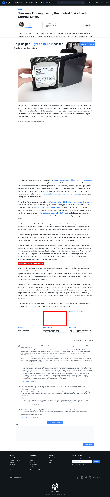

# Post 46724 - [Shucking: Finding Useful, Discounted Disks Inside External Drives](https://www.ifixit.com/News/46724/how-to-find-useful-discounted-disks-inside-an-external-hard-drive)

- https://lh4.googleusercontent.com/XcfoTvGajR9_SoJvY9Hapbo-CmRFrQNl37Oe-9ttLhgvR6s2jQO68WrH8HyMjrSl_vfzdjn-5AMVBxDLgFIxf2FxYJc5yO_bharpLAA4eZRXKFJOr9yYQ4Pxg5MBkt8_bTQ9own4
- https://valkyrie.cdn.ifixit.com/media/2017/05/05171201/galaxy-s8-fragile-600x400.jpeg

