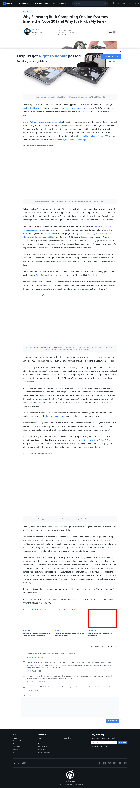

# Post 47673 - [Pourquoi les systèmes de refroidissement des Samsung Galaxy Note 20 se font-ils concurrence (et cela ne dérange pas) ?](https://www.ifixit.com/News/47673/pourquoi-les-systemes-de-refroidissement-des-samsung-galaxy-note-20-se-font-ils-concurrence-et-cela-ne-derange-pas)

- https://valkyrie.cdn.ifixit.com/media/2012/08/05154404/samsung-galaxy-note-10-1-teardown-600x400.jpeg

