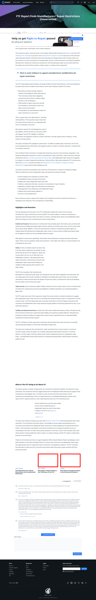

# Post 50251 - [FTC Report Finds Manufacturers’ Repair Restrictions Unwarranted](https://www.ifixit.com/News/50251/ftc-report-congress-nixing-fix-repair-restrictions-reactions)

- https://valkyrie.cdn.ifixit.com/media/2019/05/05174532/why-right-to-repair-matters-our-testimony-to-the-ftc-600x400.jpeg
- https://valkyrie.cdn.ifixit.com/media/2013/04/05155050/new-report-recognizes-repair-as-environmental-solution-600x400.jpeg
- https://valkyrie.cdn.ifixit.com/media/2013/04/05155050/new-report-recognizes-repair-as-environmental-solution-600x400.jpeg
- https://valkyrie.cdn.ifixit.com/media/2013/04/05155050/new-report-recognizes-repair-as-environmental-solution-300x200.jpeg
- https://valkyrie.cdn.ifixit.com/media/2013/04/05155050/new-report-recognizes-repair-as-environmental-solution-768x512.jpeg
- https://valkyrie.cdn.ifixit.com/media/2013/04/05155050/new-report-recognizes-repair-as-environmental-solution-324x216.jpeg
- https://valkyrie.cdn.ifixit.com/media/2013/04/05155050/new-report-recognizes-repair-as-environmental-solution-450x300.jpeg

