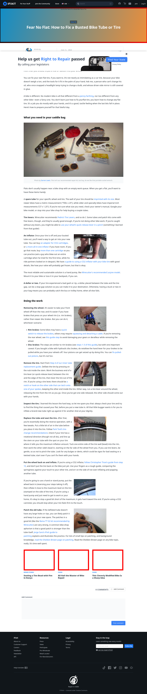

# Post 50938 - [¡Aprende a reparar un neumático de bicicleta pinchado!](https://www.ifixit.com/News/50938/aprende-a-reparar-un-neumatico-de-bicicleta-pinchado)

- https://valkyrie.cdn.ifixit.com/media/2019/06/14120945/tire_removal-1200x900.jpeg
- https://valkyrie.cdn.ifixit.com/media/2019/06/14120945/tire_removal-1200x900.jpeg
- https://valkyrie.cdn.ifixit.com/media/2019/06/14120945/tire_removal-1536x1152.jpeg
- https://valkyrie.cdn.ifixit.com/media/2019/06/14120945/tire_removal-2048x1536.jpeg
- https://valkyrie.cdn.ifixit.com/media/2012/01/05153457/mounting-tires-with-fire-in-kenya-600x400.jpeg
- https://valkyrie.cdn.ifixit.com/media/2016/03/05165308/bike-repair-master-600x400.png
- https://valkyrie.cdn.ifixit.com/media/2016/03/05165308/bike-repair-master-600x400.png
- https://valkyrie.cdn.ifixit.com/media/2016/03/05165308/bike-repair-master-300x200.png
- https://valkyrie.cdn.ifixit.com/media/2016/03/05165308/bike-repair-master-768x512.png
- https://valkyrie.cdn.ifixit.com/media/2016/03/05165308/bike-repair-master-324x216.png
- https://valkyrie.cdn.ifixit.com/media/2016/03/05165308/bike-repair-master-450x300.png
- https://valkyrie.cdn.ifixit.com/media/2016/01/05165110/modified-bike-in-mumbai-600x400.jpeg

