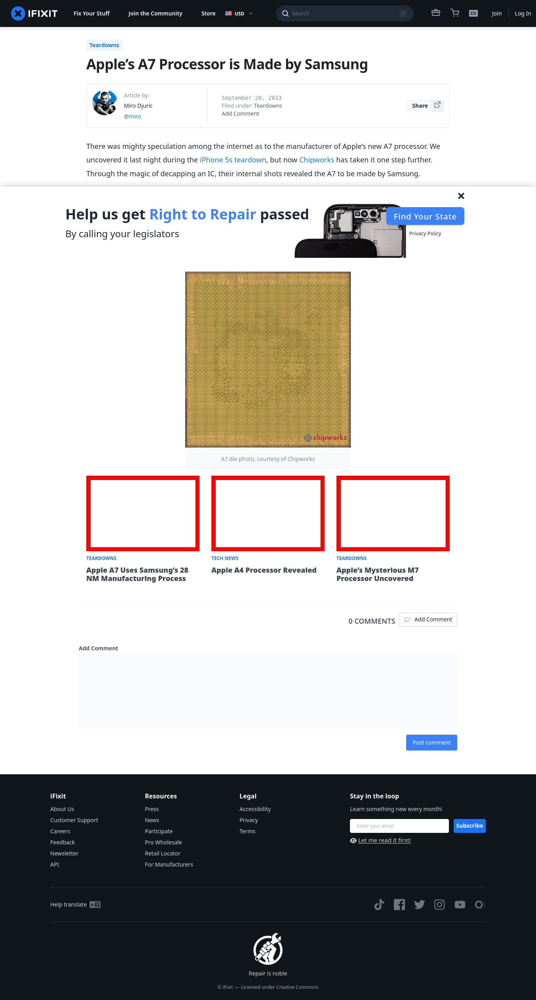

# Post 5315 - [Apple&#8217;s A7 Processor is Made by Samsung](https://www.ifixit.com/News/5315/apples-a7-processor-is-made-by-samsung)

- https://valkyrie.cdn.ifixit.com/media/2013/09/05155526/apple-a7-uses-samsungs-28-nm-manufacturing-process-600x400.jpeg
- https://valkyrie.cdn.ifixit.com/media/2013/09/05155526/apple-a7-uses-samsungs-28-nm-manufacturing-process-600x400.jpeg
- https://valkyrie.cdn.ifixit.com/media/2013/09/05155526/apple-a7-uses-samsungs-28-nm-manufacturing-process-300x200.jpeg
- https://valkyrie.cdn.ifixit.com/media/2013/09/05155526/apple-a7-uses-samsungs-28-nm-manufacturing-process-768x512.jpeg
- https://valkyrie.cdn.ifixit.com/media/2013/09/05155526/apple-a7-uses-samsungs-28-nm-manufacturing-process-324x216.jpeg
- https://valkyrie.cdn.ifixit.com/media/2013/09/05155526/apple-a7-uses-samsungs-28-nm-manufacturing-process-450x300.jpeg
- https://valkyrie.cdn.ifixit.com/media/2010/01/05151331/apple-a4-processor-revealed-600x400.jpeg
- https://valkyrie.cdn.ifixit.com/media/2013/09/05155519/apples-mysterious-m7-processor-uncovered-600x400.jpeg

