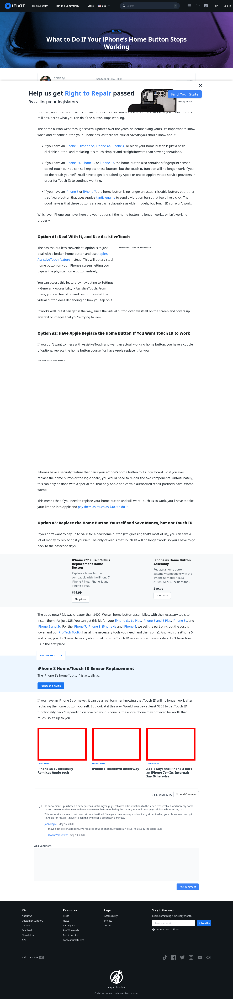

# Post 53748 - [Qué hacer si el botón de inicio de tu iPhone deja de funcionar](https://www.ifixit.com/News/53748/que-hacer-si-el-boton-de-inicio-de-tu-iphone-deja-de-funcionar)

- https://valkyrie.cdn.ifixit.com/media/2016/03/05165406/iphone-se-successfully-remixes-apple-tech-600x400.jpeg
- https://valkyrie.cdn.ifixit.com/media/2012/09/05154429/iphone-5-teardown-underway-600x400.jpeg
- https://valkyrie.cdn.ifixit.com/media/2017/09/05171833/iphone-8-teardown-600x400.jpeg

