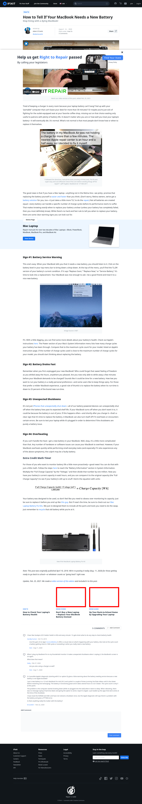

# Post 56779 - [4 Anzeichen für einen neuen Akku bei deinem MacBook](https://www.ifixit.com/News/56779/4-anzeichen-fuer-einen-neuen-akku-bei-deinem-macbook)

- https://valkyrie.cdn.ifixit.com/media/2018/04/05172454/laptop-battery-replacement-stories-600x400.jpeg
- https://valkyrie.cdn.ifixit.com/media/2018/04/05172454/laptop-battery-replacement-stories-600x400.jpeg
- https://valkyrie.cdn.ifixit.com/media/2018/04/05172454/laptop-battery-replacement-stories-300x200.jpeg
- https://valkyrie.cdn.ifixit.com/media/2018/04/05172454/laptop-battery-replacement-stories-768x512.jpeg
- https://valkyrie.cdn.ifixit.com/media/2018/04/05172454/laptop-battery-replacement-stories-324x216.jpeg
- https://valkyrie.cdn.ifixit.com/media/2018/04/05172454/laptop-battery-replacement-stories-450x300.jpeg
- https://valkyrie.cdn.ifixit.com/media/2018/08/05173007/upgrade-your-macbook-600x400.jpeg

