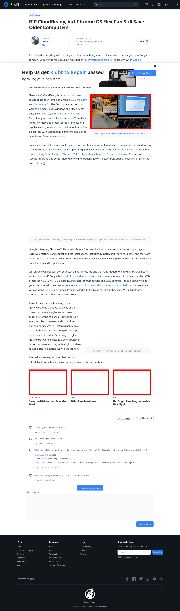

# Post 57392 - [RIP CloudReady, but Chrome OS Flex Can Still Save Older Computers](https://www.ifixit.com/News/57392/rip-cloudready-but-chrome-os-flex-can-still-save-older-computers)

- https://valkyrie.cdn.ifixit.com/media/2019/07/01110128/IMG_20190307_133458-1-1.jpg
- https://valkyrie.cdn.ifixit.com/media/2013/02/05154746/save-the-dishwasher-save-the-world-600x400.jpeg
- https://valkyrie.cdn.ifixit.com/media/2013/07/05155411/fitbit-flex-teardown-600x400.jpeg
- https://valkyrie.cdn.ifixit.com/media/2011/07/05153004/hexbright-flex-programmable-flashlight-1-600x400.jpeg

