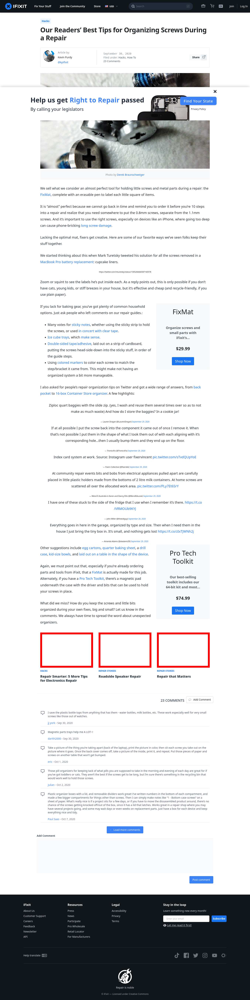

# Post 59952 - [Los mejores consejos de nuestros lectores para organizar los tornillos durante una reparación](https://www.ifixit.com/News/59952/los-mejores-consejos-de-nuestros-lectores-para-organizar-los-tornillos-durante-una-reparacion)

- https://valkyrie.cdn.ifixit.com/media/2012/09/05154415/repair-smarter-5-more-tips-for-electronics-repair-600x400.jpeg
- https://valkyrie.cdn.ifixit.com/media/2012/01/05153406/roadside-speaker-repair-600x400.jpeg
- https://valkyrie.cdn.ifixit.com/media/2012/02/05153538/repair-that-matters-600x400.jpeg

