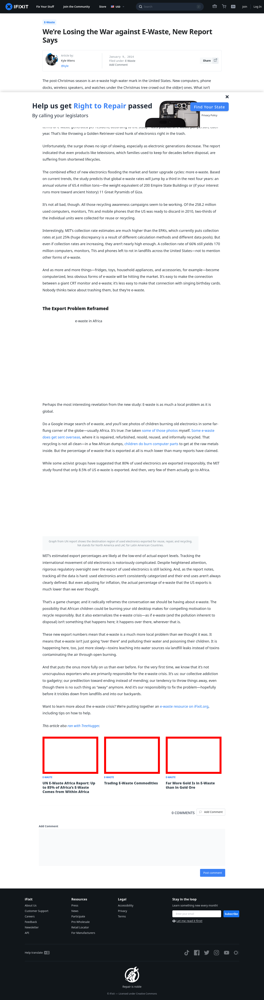

# Post 6189 - [We’re Losing the War against E-Waste, New Report Says](https://www.ifixit.com/News/6189/were-losing-the-war-against-e-waste-new-report-says)

- https://valkyrie.cdn.ifixit.com/media/2012/02/05153630/un-report-domestic-consumption-comprises-up-to-85-of-africas-e-waste-600x400.jpeg
- https://valkyrie.cdn.ifixit.com/media/2012/02/05153630/un-report-domestic-consumption-comprises-up-to-85-of-africas-e-waste-600x400.jpeg
- https://valkyrie.cdn.ifixit.com/media/2012/02/05153630/un-report-domestic-consumption-comprises-up-to-85-of-africas-e-waste-300x200.jpeg
- https://valkyrie.cdn.ifixit.com/media/2012/02/05153630/un-report-domestic-consumption-comprises-up-to-85-of-africas-e-waste-768x512.jpeg
- https://valkyrie.cdn.ifixit.com/media/2012/02/05153630/un-report-domestic-consumption-comprises-up-to-85-of-africas-e-waste-324x216.jpeg
- https://valkyrie.cdn.ifixit.com/media/2012/02/05153630/un-report-domestic-consumption-comprises-up-to-85-of-africas-e-waste-450x300.jpeg
- https://valkyrie.cdn.ifixit.com/media/2012/02/05153625/trading-commodities-600x400.jpeg
- https://valkyrie.cdn.ifixit.com/media/2012/02/05153625/trading-commodities-600x400.jpeg
- https://valkyrie.cdn.ifixit.com/media/2012/02/05153625/trading-commodities-300x200.jpeg
- https://valkyrie.cdn.ifixit.com/media/2012/02/05153625/trading-commodities-768x512.jpeg
- https://valkyrie.cdn.ifixit.com/media/2012/02/05153625/trading-commodities-324x216.jpeg
- https://valkyrie.cdn.ifixit.com/media/2012/02/05153625/trading-commodities-450x300.jpeg
- https://valkyrie.cdn.ifixit.com/media/2012/07/05154253/far-more-gold-is-in-e-waste-than-in-gold-ore-1-600x400.jpeg

