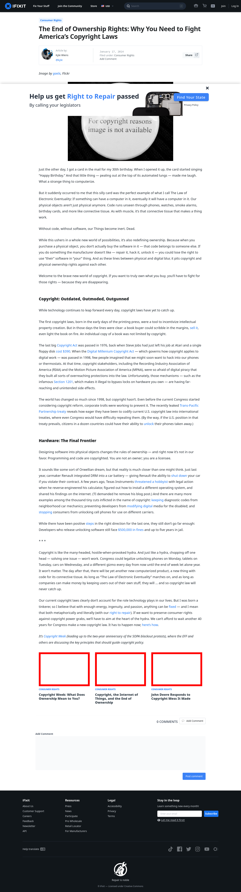

# Post 6207 - [The End of Ownership Rights: Why You Need to Fight America’s Copyright Laws](https://www.ifixit.com/News/6207/the-end-of-ownership-why-you-need-to-fight-americas-copyright-laws)

- https://valkyrie.cdn.ifixit.com/media/2019/01/05173603/meaning-of-ownership-600x400.jpeg
- https://valkyrie.cdn.ifixit.com/media/2019/01/05173603/meaning-of-ownership-600x400.jpeg
- https://valkyrie.cdn.ifixit.com/media/2019/01/05173603/meaning-of-ownership-300x200.jpeg
- https://valkyrie.cdn.ifixit.com/media/2019/01/05173603/meaning-of-ownership-768x512.jpeg
- https://valkyrie.cdn.ifixit.com/media/2019/01/05173603/meaning-of-ownership-324x216.jpeg
- https://valkyrie.cdn.ifixit.com/media/2019/01/05173603/meaning-of-ownership-450x300.jpeg
- https://valkyrie.cdn.ifixit.com/media/2016/06/05165813/copyright-and-the-end-of-ownership-600x400.jpeg
- https://valkyrie.cdn.ifixit.com/media/2015/05/05164216/john-deere-mess-1-600x400.jpeg

