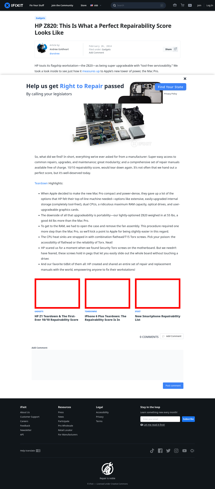

# Post 6327 - [HP Z820: This Is What a Perfect Repairability Score Looks Like](https://www.ifixit.com/News/6327/this-is-what-a-workstation-with-a-perfect-repairability-score-looks-like)

- https://valkyrie.cdn.ifixit.com/media/2012/04/05154040/hp-z1-teardown-the-first-ever-1010-repairability-score-1-600x400.jpeg
- https://valkyrie.cdn.ifixit.com/media/2014/09/05163411/iphone-6-plus-600x400.jpeg
- https://valkyrie.cdn.ifixit.com/media/2013/09/05155533/new-smartphone-repairability-list-600x400.jpeg
- https://valkyrie.cdn.ifixit.com/media/2013/09/05155533/new-smartphone-repairability-list-600x400.jpeg
- https://valkyrie.cdn.ifixit.com/media/2013/09/05155533/new-smartphone-repairability-list-300x200.jpeg
- https://valkyrie.cdn.ifixit.com/media/2013/09/05155533/new-smartphone-repairability-list-324x216.jpeg
- https://valkyrie.cdn.ifixit.com/media/2013/09/05155533/new-smartphone-repairability-list-450x300.jpeg

