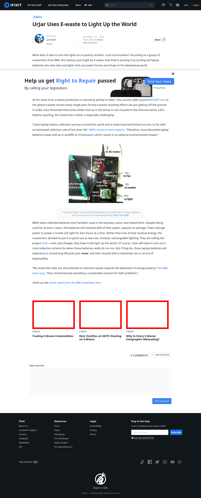

# Post 6860 - [UrJar Uses E-waste to Light Up the World](https://www.ifixit.com/News/6860/urjar)

- https://valkyrie.cdn.ifixit.com/media/2012/02/05153625/trading-commodities-600x400.jpeg
- https://valkyrie.cdn.ifixit.com/media/2012/02/05153625/trading-commodities-600x400.jpeg
- https://valkyrie.cdn.ifixit.com/media/2012/02/05153625/trading-commodities-300x200.jpeg
- https://valkyrie.cdn.ifixit.com/media/2012/02/05153625/trading-commodities-768x512.jpeg
- https://valkyrie.cdn.ifixit.com/media/2012/02/05153625/trading-commodities-324x216.jpeg
- https://valkyrie.cdn.ifixit.com/media/2012/02/05153625/trading-commodities-450x300.jpeg
- https://valkyrie.cdn.ifixit.com/media/2012/05/05154128/kyle-testifies-at-usitc-hearing-on-e-waste-600x400.jpeg
- https://valkyrie.cdn.ifixit.com/media/2012/04/05154012/why-is-every-e-waste-infographic-misleading-600x400.jpeg
- https://valkyrie.cdn.ifixit.com/media/2012/04/05154012/why-is-every-e-waste-infographic-misleading-600x400.jpeg
- https://valkyrie.cdn.ifixit.com/media/2012/04/05154012/why-is-every-e-waste-infographic-misleading-300x200.jpeg
- https://valkyrie.cdn.ifixit.com/media/2012/04/05154012/why-is-every-e-waste-infographic-misleading-324x216.jpeg
- https://valkyrie.cdn.ifixit.com/media/2012/04/05154012/why-is-every-e-waste-infographic-misleading-450x300.jpeg

