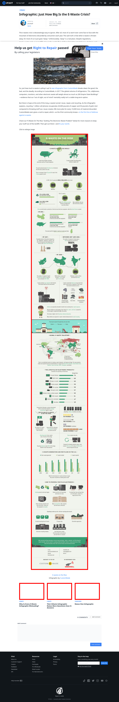

# Post 6966 - [Infographic: Just How Big Is the E-Waste Crisis?](https://www.ifixit.com/News/6966/infographic-e-waste)

- http://www.custommade.com/blog/content/uploads/2014/12/ewaste-final.jpg
- https://valkyrie.cdn.ifixit.com/media/2012/04/05154012/why-is-every-e-waste-infographic-misleading-600x400.jpeg
- https://valkyrie.cdn.ifixit.com/media/2012/04/05154012/why-is-every-e-waste-infographic-misleading-600x400.jpeg
- https://valkyrie.cdn.ifixit.com/media/2012/04/05154012/why-is-every-e-waste-infographic-misleading-300x200.jpeg
- https://valkyrie.cdn.ifixit.com/media/2012/04/05154012/why-is-every-e-waste-infographic-misleading-324x216.jpeg
- https://valkyrie.cdn.ifixit.com/media/2012/04/05154012/why-is-every-e-waste-infographic-misleading-450x300.jpeg
- https://valkyrie.cdn.ifixit.com/media/2012/01/05153416/this-e-waste-infographic-raises-more-questions-than-it-answers-600x400.jpeg
- https://valkyrie.cdn.ifixit.com/media/2010/03/05152044/nexus-one-infographic-600x400.jpeg

