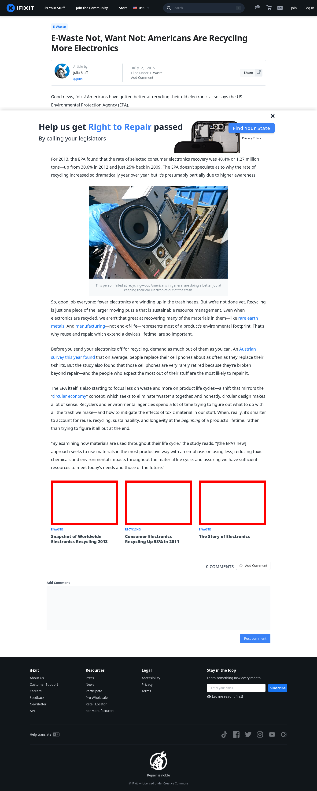

# Post 7227 - [E-Waste Not, Want Not: Americans Are Recycling More Electronics](https://www.ifixit.com/News/7227/e-waste-not)

- https://valkyrie.cdn.ifixit.com/media/2013/05/05155101/snapshot-of-worldwide-electronics-recycling-2013-600x400.jpeg
- https://valkyrie.cdn.ifixit.com/media/2012/04/05153955/consumer-electronics-recycling-up-53-in-2011-600x400.jpeg
- https://valkyrie.cdn.ifixit.com/media/2010/11/05152611/the-story-of-electronics-600x400.jpeg
- https://valkyrie.cdn.ifixit.com/media/2010/11/05152611/the-story-of-electronics-600x400.jpeg
- https://valkyrie.cdn.ifixit.com/media/2010/11/05152611/the-story-of-electronics-300x200.jpeg
- https://valkyrie.cdn.ifixit.com/media/2010/11/05152611/the-story-of-electronics-324x216.jpeg
- https://valkyrie.cdn.ifixit.com/media/2010/11/05152611/the-story-of-electronics-450x300.jpeg

