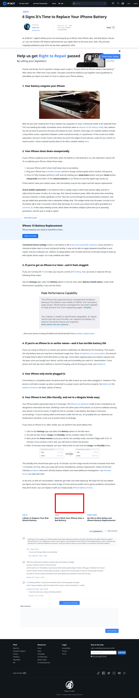

# Post 73078 - [iPhoneバッテリーの交換時期が近づいている6つのサイン](https://www.ifixit.com/News/73078/iphone%e3%83%90%e3%83%83%e3%83%86%e3%83%aa%e3%83%bc%e3%81%ae%e4%ba%a4%e6%8f%9b%e6%99%82%e6%9c%9f%e3%81%8c%e8%bf%91%e3%81%a5%e3%81%84%e3%81%a6%e3%81%84%e3%82%8b6%e3%81%a4%e3%81%ae%e3%82%b5%e3%82%a4)

- https://valkyrie.cdn.ifixit.com/media/2017/04/05171108/iphone-bad-battery-600x400.jpeg
- https://valkyrie.cdn.ifixit.com/media/2017/04/05171108/iphone-bad-battery-600x400.jpeg
- https://valkyrie.cdn.ifixit.com/media/2017/04/05171108/iphone-bad-battery-300x200.jpeg
- https://valkyrie.cdn.ifixit.com/media/2017/04/05171108/iphone-bad-battery-768x512.jpeg
- https://valkyrie.cdn.ifixit.com/media/2017/04/05171108/iphone-bad-battery-324x216.jpeg
- https://valkyrie.cdn.ifixit.com/media/2017/04/05171108/iphone-bad-battery-450x300.jpeg

