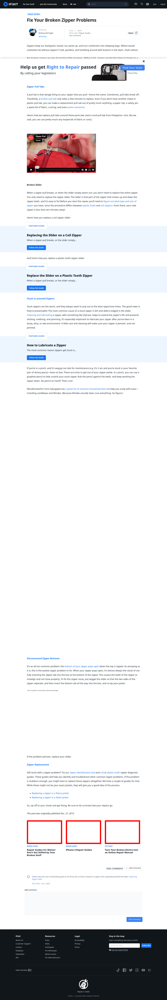

# Post 7531 - [Fix Your Broken Zipper Problems](https://www.ifixit.com/News/7531/zipper-problems)

- https://valkyrie.cdn.ifixit.com/media/2015/01/05163820/repair-guides-for-winter-600x400.jpeg
- https://valkyrie.cdn.ifixit.com/media/2015/01/05163820/repair-guides-for-winter-600x400.jpeg
- https://valkyrie.cdn.ifixit.com/media/2015/01/05163820/repair-guides-for-winter-300x200.jpeg
- https://valkyrie.cdn.ifixit.com/media/2015/01/05163820/repair-guides-for-winter-768x512.jpeg
- https://valkyrie.cdn.ifixit.com/media/2015/01/05163820/repair-guides-for-winter-324x216.jpeg
- https://valkyrie.cdn.ifixit.com/media/2015/01/05163820/repair-guides-for-winter-450x300.jpeg
- https://valkyrie.cdn.ifixit.com/media/2010/06/05152323/iphone-4-repair-guides-600x400.jpeg
- https://valkyrie.cdn.ifixit.com/media/2012/02/05153702/turn-your-broken-device-into-a-repair-manual-600x400.jpeg

