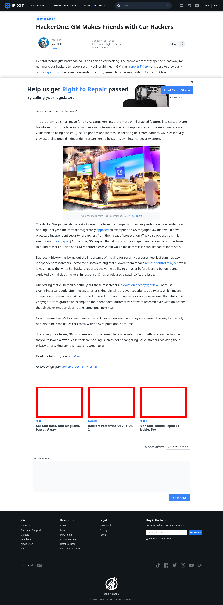

# Post 7774 - [HackerOne: GM Makes Friends with Car Hackers](https://www.ifixit.com/News/7774/gm-car-hackers)

- https://valkyrie.cdn.ifixit.com/media/2014/11/05163540/tom-magliozzi-2-600x400.jpeg
- https://valkyrie.cdn.ifixit.com/media/2014/11/05163540/tom-magliozzi-2-600x400.jpeg
- https://valkyrie.cdn.ifixit.com/media/2014/11/05163540/tom-magliozzi-2-300x200.jpeg
- https://valkyrie.cdn.ifixit.com/media/2014/11/05163540/tom-magliozzi-2-324x216.jpeg
- https://valkyrie.cdn.ifixit.com/media/2014/11/05163540/tom-magliozzi-2-450x300.jpeg
- https://valkyrie.cdn.ifixit.com/media/2016/08/05165952/osvr_hdk2_teardown-600x400.jpeg
- https://valkyrie.cdn.ifixit.com/media/2015/01/05163818/car-talk-600x400.jpeg
- https://valkyrie.cdn.ifixit.com/media/2015/01/05163818/car-talk-600x400.jpeg
- https://valkyrie.cdn.ifixit.com/media/2015/01/05163818/car-talk-300x200.jpeg
- https://valkyrie.cdn.ifixit.com/media/2015/01/05163818/car-talk-324x216.jpeg
- https://valkyrie.cdn.ifixit.com/media/2015/01/05163818/car-talk-450x300.jpeg

