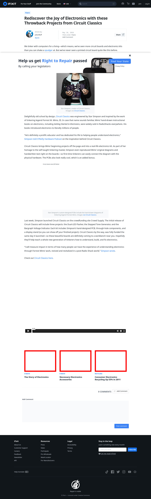

# Post 8099 - [Rediscover the Joy of Electronics with these Throwback Projects from Circuit Classics](https://www.ifixit.com/News/8099/circuit-classics)

- https://valkyrie.cdn.ifixit.com/media/2010/11/05152611/the-story-of-electronics-600x400.jpeg
- https://valkyrie.cdn.ifixit.com/media/2010/11/05152611/the-story-of-electronics-600x400.jpeg
- https://valkyrie.cdn.ifixit.com/media/2010/11/05152611/the-story-of-electronics-300x200.jpeg
- https://valkyrie.cdn.ifixit.com/media/2010/11/05152611/the-story-of-electronics-324x216.jpeg
- https://valkyrie.cdn.ifixit.com/media/2010/11/05152611/the-story-of-electronics-450x300.jpeg
- https://valkyrie.cdn.ifixit.com/media/2012/03/05153713/necessary-accessories-600x400.jpeg
- https://valkyrie.cdn.ifixit.com/media/2012/04/05153955/consumer-electronics-recycling-up-53-in-2011-600x400.jpeg

