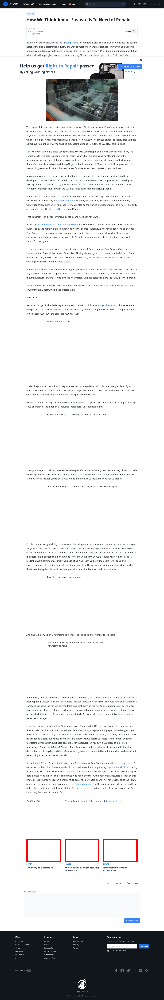

# Post 8264 - [How We Think About E-waste Is In Need of Repair](https://www.ifixit.com/News/8264/e-waste-is-in-need-of-repair)

- https://valkyrie.cdn.ifixit.com/media/2010/11/05152611/the-story-of-electronics-600x400.jpeg
- https://valkyrie.cdn.ifixit.com/media/2010/11/05152611/the-story-of-electronics-600x400.jpeg
- https://valkyrie.cdn.ifixit.com/media/2010/11/05152611/the-story-of-electronics-300x200.jpeg
- https://valkyrie.cdn.ifixit.com/media/2010/11/05152611/the-story-of-electronics-324x216.jpeg
- https://valkyrie.cdn.ifixit.com/media/2010/11/05152611/the-story-of-electronics-450x300.jpeg
- https://valkyrie.cdn.ifixit.com/media/2012/05/05154128/kyle-testifies-at-usitc-hearing-on-e-waste-600x400.jpeg
- https://valkyrie.cdn.ifixit.com/media/2012/03/05153713/necessary-accessories-600x400.jpeg

