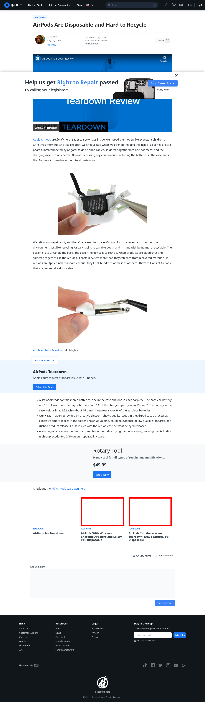

# Post 8690 - [AirPods Are Disposable and Hard to Recycle](https://www.ifixit.com/News/8690/airpods-are-disposable)

- https://valkyrie.cdn.ifixit.com/media/2019/03/05174135/new-airpods-with-wireless-charging-are-here-and-probably-still-disposable-600x400.png
- https://valkyrie.cdn.ifixit.com/media/2019/03/05174135/new-airpods-with-wireless-charging-are-here-and-probably-still-disposable-600x400.png
- https://valkyrie.cdn.ifixit.com/media/2019/03/05174135/new-airpods-with-wireless-charging-are-here-and-probably-still-disposable-300x200.png
- https://valkyrie.cdn.ifixit.com/media/2019/03/05174135/new-airpods-with-wireless-charging-are-here-and-probably-still-disposable-768x512.png
- https://valkyrie.cdn.ifixit.com/media/2019/03/05174135/new-airpods-with-wireless-charging-are-here-and-probably-still-disposable-324x216.png
- https://valkyrie.cdn.ifixit.com/media/2019/03/05174135/new-airpods-with-wireless-charging-are-here-and-probably-still-disposable-450x300.png
- https://valkyrie.cdn.ifixit.com/media/2019/03/05174219/airpods-2nd-generation-teardown-new-features-still-disposable-600x400.jpeg

