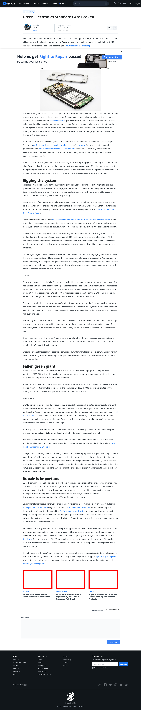

# Post 9278 - [Green Electronics Standards Are Broken](https://www.ifixit.com/News/9278/electronics-standards)

- https://valkyrie.cdn.ifixit.com/media/2019/05/05174643/expert-volunteers-needed-green-electronics-standards-600x400.png
- https://valkyrie.cdn.ifixit.com/media/2019/05/05174643/expert-volunteers-needed-green-electronics-standards-600x400.png
- https://valkyrie.cdn.ifixit.com/media/2019/05/05174643/expert-volunteers-needed-green-electronics-standards-300x200.png
- https://valkyrie.cdn.ifixit.com/media/2019/05/05174643/expert-volunteers-needed-green-electronics-standards-324x216.png
- https://valkyrie.cdn.ifixit.com/media/2019/05/05174643/expert-volunteers-needed-green-electronics-standards-450x300.png
- https://valkyrie.cdn.ifixit.com/media/2012/01/05153434/sprint-promises-improved-repairability-but-green-standards-still-fall-short-600x400.jpeg
- https://valkyrie.cdn.ifixit.com/media/2012/07/05154250/apple-ditches-green-standard-cuts-off-federal-agencies-from-apple-products-600x400.jpeg

