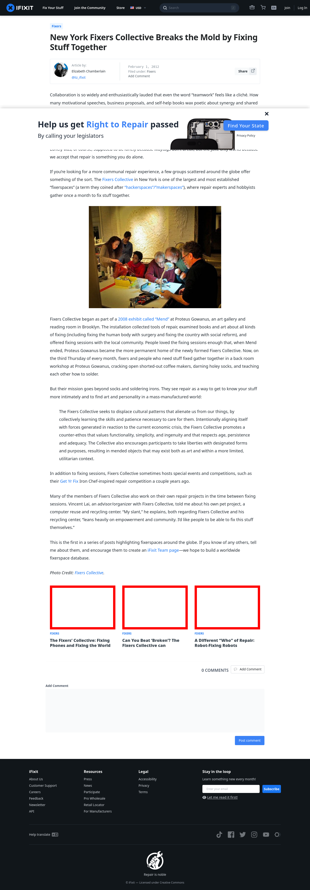

# Post 994 - [New York Fixers Collective Breaks the Mold by Fixing Stuff Together](https://www.ifixit.com/News/994/new-york-fixers-collective-breaks-the-mold-by-fixing-stuff-together)

- https://valkyrie.cdn.ifixit.com/media/2016/02/05165237/fixing-phones-fixing-the-world-600x400.jpeg
- https://valkyrie.cdn.ifixit.com/media/2014/05/05163119/can-you-beat-broken-1-600x400.jpeg
- https://valkyrie.cdn.ifixit.com/media/2012/02/05153616/a-different-who-of-repair-robot-fixing-robots-600x400.jpeg
- https://valkyrie.cdn.ifixit.com/media/2012/02/05153616/a-different-who-of-repair-robot-fixing-robots-600x400.jpeg
- https://valkyrie.cdn.ifixit.com/media/2012/02/05153616/a-different-who-of-repair-robot-fixing-robots-300x200.jpeg
- https://valkyrie.cdn.ifixit.com/media/2012/02/05153616/a-different-who-of-repair-robot-fixing-robots-324x216.jpeg
- https://valkyrie.cdn.ifixit.com/media/2012/02/05153616/a-different-who-of-repair-robot-fixing-robots-450x300.jpeg

